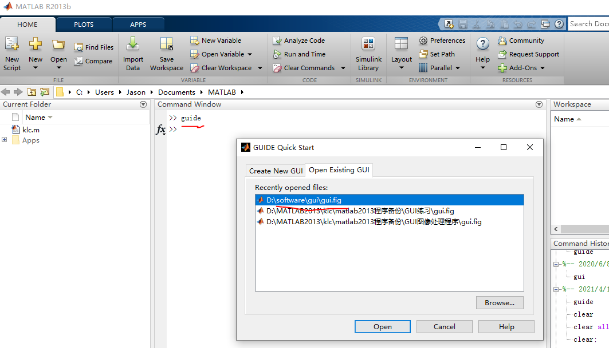
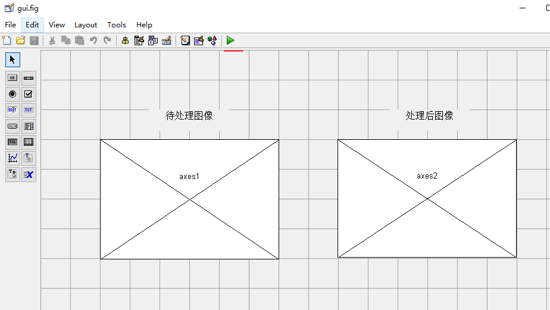
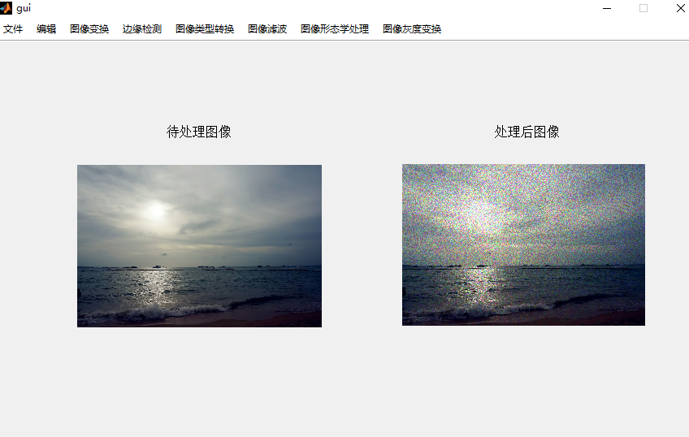

# MATLAB2013实现图像处理GUI界面设计

## 目录结构

* images ———— 资源图片
* src ———— 操作步骤图
* gui.fig, gui.m 源程序文件
* gui.md 指导文件

## 操作指导

1. 首先在Matalb命令行中输入guide指令:

2. 点击open,打开我设计好的界面如下:

* 主界面主要包含两个axes来显示图像处理前后的效果。点击绿色运行键，选择change Folder

3. 实际操作，添加噪声:

